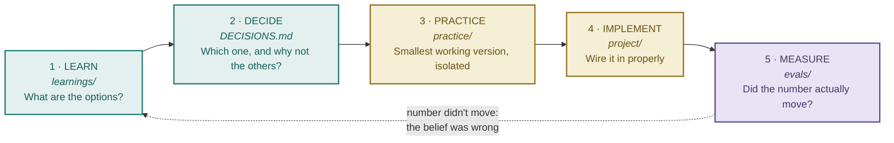
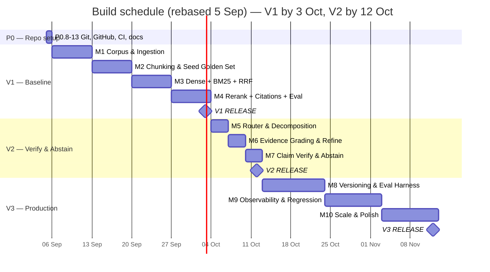

# no-cap-rag — Advanced RAG Build Blueprint

**Domain:** retail knowledge (public retail policies + synthetic retail enterprise documents)
**Commitment:** V1 by **3 Oct 2026**, V2 by **12 Oct 2026**. V3 by **12 Nov 2026**, uncommitted.
*(Rebased 5 Sep 2026 — see [§3](#3-schedule-at-a-glance). Original targets were 21/30 Sep; repo & GitHub setup ran long, so every date below shifted by the same ~12 days rather than compressing milestone durations.)*
**Method:** every milestone runs Learn → Decide → Practice → Implement → Measure. Nothing enters `project/` that hasn't been understood in isolation first.

Companion documents:
- [`ANALOGY.md`](./ANALOGY.md) — the Research Office analogy every module docstring assumes
- [`DECISIONS.md`](./DECISIONS.md) — every technology choice, why, and what was rejected
- [`../Project_1_Advanced_RAG_PRD_Architecture.pdf`](./Project_1_Advanced_RAG_PRD_Architecture.pdf) — source-of-truth PRD (never edited; deviations live in DECISIONS.md)
- [`docs/architecture.jpg`](./docs/architecture.jpg) — system architecture

---

## Table of contents

1. [How to use this document](#1-how-to-use-this-document)
2. [The method: why learning comes before code](#2-the-method-why-learning-comes-before-code)
3. [Schedule at a glance](#3-schedule-at-a-glance)
4. [M1 — Corpus & Ingestion](#4-m1--corpus--ingestion)
5. [M2 — Chunking & Seed Golden Set](#5-m2--chunking--seed-golden-set)
6. [M3 — Dense, BM25 & RRF](#6-m3--dense-bm25--rrf)
7. [M4 — Reranking, Citations & Evaluation → V1](#7-m4--reranking-citations--evaluation--v1)
8. [M5 — Router & Decomposition](#8-m5--router--decomposition)
9. [M6 — Evidence Grading & Refinement](#9-m6--evidence-grading--refinement)
10. [M7 — Claim Verification & Abstention → V2](#10-m7--claim-verification--abstention--v2)
11. [V3 — M8 to M10](#11-v3--m8-to-m10)
12. [Experiment register](#12-experiment-register)
13. [Risks and cut-lines](#13-risks-and-cut-lines)

---

## 1. How to use this document

This is a working blueprint, not a spec to admire. Each milestone below gives you:

- **Goal** — what exists at the end that didn't exist at the start
- **Why here** — why this milestone comes at this point and not earlier or later
- **Tasks** — numbered `T-MN.n`, each tagged with its phase in the learning loop
- **What you're choosing between** — the real alternatives, with the reasoning
- **Exit criteria** — the objective test for "done", so you never move on from a half-built milestone

Task checkboxes live in `learnings/<milestone>/TASKS.md` so you can tick them where you're actually working. This file holds the reasoning; those files hold the checklist.

**The rule that matters most:** a task tagged `[LEARN]` or `[DECIDE]` produces *writing*, not code. If you find yourself opening an editor on `app/` during a `[LEARN]` task, you've skipped a step — and the code you write will encode a decision you haven't actually made yet.

---

## 2. The method: why learning comes before code

Every milestone runs the same five phases:



**Why this order, specifically:**

**Learn before deciding** — otherwise you pick the first technique you read about and rationalize it afterwards. The point of this project is defensible choices.

**Decide before practicing** — writing down "I chose structure-aware chunking over semantic chunking because retail policies have real heading structure and semantic chunking would cut across clause boundaries" takes ten minutes and becomes a README section later. Deciding *after* building means writing a justification for whatever you happened to build.

**Practice before implementing** — this is the phase most people skip, and it's the one that saves the most time. When you implement a new technique directly into the app and it doesn't work, you're debugging two things simultaneously: *is my understanding of RRF wrong, or is my wiring wrong?* A 30-line script in `practice/` that fuses two hardcoded ranked lists answers the first question definitively, so the second one becomes easy.

**Measure before moving on** — an improvement you didn't measure isn't an improvement, it's a belief. This is the entire thesis of the project, and it applies to your own build process first.

**And when the number doesn't move:** that's not a failure, that's the loop working. It means a belief you held was wrong — which is exactly the material that makes the "failure analysis" section of the README worth reading.

---

## 3. Schedule at a glance

Today is **5 Sep 2026**. The application skeleton (T-P0.1–7) has been complete
since 24 Aug; the repository/GitHub setup (T-P0.8–13) is the outstanding
Phase 0 work and starts today.

> **Rebase note.** The original plan assumed P0 finished on 24 Aug and M1
> started 25 Aug. Repo/GitHub setup didn't happen on schedule, so 12 days
> passed with the code sitting complete but unprotected. Rather than
> compress M1–M10 to still hit the original 21/30 Sep dates — which would
> just repeat the "vibes-based" shortcut-taking this project argues
> against — every milestone below keeps its original duration and the
> whole schedule shifts by the same 12 days.



| Milestone | Dates | Ships | Core question it answers |
|---|---|---|---|
| **P0 remainder** | Sep 5 | — | Is the code actually under version control? |
| **M1** | Sep 6 – Sep 12 | — | What are we retrieving *from*? |
| **M2** | Sep 13 – Sep 19 | — | What is the retrievable unit, and how do we know it's good? |
| **M3** | Sep 20 – Sep 26 | — | How do we find candidates, and does hybrid actually beat dense? |
| **M4** | Sep 27 – Oct 3 | **V1** | How good is it, in numbers, and can every claim be traced? |
| **M5** | Oct 4 – Oct 6 | — | Do all questions deserve the same pipeline? |
| **M6** | Oct 7 – Oct 9 | — | How do we know the evidence is good *before* answering? |
| **M7** | Oct 10 – Oct 12 | **V2** | How do we verify what we wrote, and refuse when we can't? |
| M8 | Oct 13 – Oct 23 | — | Is it current, not just correct? |
| M9 | Oct 24 – Nov 2 | — | Is it observable, and does it catch its own regressions? |
| M10 | Nov 3 – Nov 12 | **V3** | Is it operable at scale, and provider-agnostic? |

**The critical path runs through M1.** Every later milestone measures against the corpus and golden questions built in M1–M2. A weak corpus produces meaningless metrics for six weeks, and it is the one thing that cannot be fixed later without invalidating every number you've collected.

---

## 4. M1 — Corpus & Ingestion

**Sep 6 – Sep 12 · Goal:** a reproducible retail corpus, ingested with stable IDs and content hashes, queryable from Postgres.

### Why here

Retrieval quality is bounded by corpus quality, and every metric from M3 onward is measured against this data. It comes first because it's the only part of the system whose defects are invisible in code review and only surface as inexplicably bad numbers three weeks later.

The PRD is emphatic about this: *"Do not make Jira, Slack, Confluence or internal company databases prerequisites."* Waiting for real enterprise data access is how this project dies in week one. You build a corpus you fully control instead.

### The corpus design

Two halves, deliberately:

**Half A — public retail sources (~15–25 documents).** Real published policy pages from retail companies: returns and refunds, shipping and delivery, warranty terms, loyalty program terms, gift card terms, price-match policies, size guides, payment/EMI terms.

*Why include public documents at all, when synthetic ones are easier to control?* Because real documents are messy in ways you would never think to simulate — inconsistent heading structure, marketing copy interleaved with policy text, tables rendered as unlabeled divs, footnotes that carry the actual exception. If your pipeline only ever sees documents you authored, it's tuned to your own writing habits, and the first real document breaks it.

**Half B — synthetic retail enterprise documents (~25–35 documents).** These carry a visible `SYNTHETIC — illustrative, not from any real company` banner in the document itself and a `is_synthetic: true` flag in metadata. Non-negotiable: this is a public portfolio repo, and unlabelled fabricated corporate documents are indistinguishable from a forgery.

*Why synthetic documents are necessary:* public retail pages are all customer-facing and shallow. They give you no internal operational documents, no version chains, and no cross-document contradictions — which is exactly the material V2 and V3 need.

Suggested inventory, chosen for the *relationships* they create:

| Category | Documents | What it enables downstream |
|---|---|---|
| Customer policy | Returns v2.0 **and** v3.0, Shipping, Warranty, Gift Cards, Price Match | Version supersession chain (V3); contradictions between versions |
| Loyalty | Loyalty Program Rules v1.0 **and** v2.0 (tier thresholds changed), Points Expiry Policy | Multi-hop with returns; "which version is current" questions |
| Promotions | Discount Stacking Rules, Markdown Policy, Campaign Brief (BOGO mechanics) | Multi-hop; genuinely ambiguous questions |
| Store SOPs | Opening/Closing Checklist, Cash Handling, Stock Take, Returns Exception Matrix | Exact identifiers (SOP-RET-014); procedural questions |
| Incidents | POS Outage postmortem, Payment Gateway Failure, Inventory Sync Failure, Loyalty Double-Credit | Error codes; "what happened when X" questions |
| Runbooks | Failed Refund, Delivery Dispute, Chargeback Handling | Procedural multi-step retrieval |
| ADRs | Order Management System choice, Loyalty Platform choice | Rationale questions; long-context |
| Staff | Shift Policy, Employee Discount Policy, Leave Policy | Adjacent-domain distractors (tests precision) |

**Three properties to build in deliberately:**

1. **Exact identifiers throughout.** `SOP-RET-014`, `POS-ERR-3021`, `GOLD_TIER`, `SKU-88213`, `PROMO-DIWALI-24`. These are what make BM25 beat dense retrieval on a measurable subset of questions. Without them, your dense-vs-hybrid ablation shows noise and you'll wrongly conclude hybrid retrieval isn't worth it.

2. **At least three version pairs.** Returns v2.0 → v3.0, Loyalty v1.0 → v2.0, and one SOP revision. Each newer document declares `supersedes` and `effective_date`. This is dormant until V3 — but retrofitting version chains onto a finished corpus means re-authoring documents and re-labelling every affected golden question.

3. **At least five genuine cross-document dependencies.** A returns question whose complete answer requires the loyalty policy. A refund runbook that references the returns exception matrix by SOP number. These are your real multi-hop cases, and contrived ones are obvious to anyone reading the repo.

### Tasks

| # | Phase | Task |
|---|---|---|
| T-M1.1 | LEARN | Read on RAG corpus/eval-set design. Write `learnings/01-corpus-ingestion/notes.md`: what makes a corpus good for *evaluation* (not just retrieval), and why an unrepresentative corpus silently invalidates every downstream metric. |
| T-M1.2 | DECIDE | Write the corpus manifest: exact list of public URLs + the synthetic document inventory, with the version pairs and cross-document dependencies planned explicitly. Save as `corpus/MANIFEST.md`. |
| T-M1.3 | BUILD | Author the synthetic documents (~25–35). Markdown, real heading structure, visible SYNTHETIC banner, identifiers baked in. **Largest single time cost in M1 — budget 2–3 days.** |
| T-M1.4 | IMPLEMENT | `app/ingestion/sources/` — URL fetcher and file loader behind one `Source` interface. |
| T-M1.5 | IMPLEMENT | Document registry in Postgres per the PRD data model: `id, source_url, type, title, version, effective_date, fetched_at, content_hash, supersedes, metadata`. |
| T-M1.6 | IMPLEMENT | Content-hash idempotency: re-ingesting an unchanged document is a no-op; a changed document creates a new version row. |
| T-M1.7 | IMPLEMENT | `POST /documents/ingest` + `GET /documents/{id}`, and an ingestion CLI (the PRD lists a reproducible ingestion CLI as a portfolio deliverable). |
| T-M1.8 | MEASURE | Run ingestion twice over the full corpus. Assert zero duplicate rows. Assert every document has non-null provenance fields. |

### What you're choosing between

**Storing raw documents on disk vs. in Postgres.** Disk (`corpus/`, git-tracked) — the corpus is a portfolio artifact people should be able to read on GitHub, and it's diffable. Postgres holds metadata and pointers. Storing document bodies as blobs in Postgres makes the corpus invisible to anyone browsing the repo.

**Hashing raw bytes vs. extracted text.** Hash the *extracted text*. A PDF re-exported with a new timestamp has different bytes but identical content; hashing bytes would trigger a spurious re-ingest and a false version bump. This matters directly at M8 when freshness recrawl uses the same hash.

### Exit criteria

- [ ] 40+ documents ingested; every synthetic one visibly labelled
- [ ] Re-running ingestion produces zero duplicates (proven, not assumed)
- [ ] Every document row has `content_hash`, `title`, `type`, `version`
- [ ] At least 3 version pairs with `supersedes` populated
- [ ] `corpus/MANIFEST.md` documents every source and its licence/terms status

---

## 5. M2 — Chunking & Seed Golden Set

**Sep 13 – Sep 19 · Goal:** documents split into a defensible retrievable unit; 50 labelled questions so M3's choices are measured.

### Why here

Chunking decides what the retrievable unit *is*. Every downstream metric is bounded by it: if the answer to a question is split across two chunks, no retrieval strategy, no fusion algorithm and no reranker can fully recover it. Fixing chunking later invalidates every index and every retrieval number you've collected.

The seed golden set lands here rather than at M4 ([D-004](./DECISIONS.md)) because M3 asks you to choose between dense, BM25 and multiple fusion settings — and those choices need numbers, not impressions.

For the same reason, Recall@K and MRR — the two metrics M3 actually reports — are learned and implemented here too, not at M4 ([D-010](./DECISIONS.md)). A golden set without working, understood scoring functions to run against it is still an impression, just a more elaborate one.

### Chunking strategies to learn

Learn all six. Implement three. Ship one.

| Strategy | How it works | Best for | Why not here |
|---|---|---|---|
| **Fixed-size** | Every N tokens, fixed overlap | Baseline only | Splits mid-clause. A returns exception gets severed from the rule it modifies |
| **Recursive character** | Split on separator hierarchy (`\n\n` → `\n` → `.`) | General prose, sensible default | Ignores document semantics — treats a heading as just another newline |
| **Semantic / percentile-breakpoint** | Embed sentences, split where consecutive-sentence distance exceeds a percentile threshold | Unstructured prose, transcripts, articles | Retail policies *have* explicit structure; inferring boundaries statistically discards ground truth you already possess. Also costs an embedding pass per document |
| **Structure-aware** ✅ | Split on the document's own heading/section hierarchy, with token-count guards for over/undersized sections | Structured documents — policies, SOPs, contracts | **This is the choice.** Reasoning below |
| **Contextual prefix** ✅ | Prepend locating context to each chunk before embedding/indexing | Any chunk that loses meaning out of context | **Layered on top of structure-aware.** Reasoning below |
| **Parent-document / small-to-big** | Retrieve small precise chunks, return their larger parent for generation | Precision-recall tension | Adds a retrieval indirection layer. Revisit at M4 only if evidence-quality analysis shows chunks are too small to answer from |

**Why structure-aware wins for this corpus:** retail policies are *natively* structured — "3.2 Returns for Discounted Items" is an authored, meaningful boundary. Semantic chunking would try to *infer* that boundary from embedding distances, which is strictly worse than reading the heading that's already there. Structure-aware chunking also gives you `section_path` for free, which becomes the human-readable citation ("Returns Policy v3.0 §3.2") — semantic chunking gives you chunk #47.

**Why not semantic chunking, given you already know it:** it's the right tool for unstructured prose, and this corpus isn't that. That's a genuinely defensible answer to "why didn't you use semantic chunking?" — and you'll have the ablation number to back it up (Experiment A).

**Why contextual prefix matters enormously here:** consider a real chunk from a retail returns policy:

> *"This exception does not apply to items purchased during clearance events."*

Embedded alone, this matches almost nothing useful. It has no subject. Prepending its location:

> *"Returns Policy v3.0 → Section 3.2 Discounted Items: This exception does not apply to items purchased during clearance events."*

...makes it self-contained for both dense embedding and BM25. This is Anthropic's Contextual Retrieval idea in its cheap deterministic form — template-built from `section_path` rather than LLM-generated per chunk. Start with the template version; if M4's evidence analysis shows chunks still lack context, upgrade to LLM-generated prefixes and measure the delta.

### The seed golden set (50 questions)

Per the PRD, spread across categories. Retail examples to make each concrete:

| Category | n | Example |
|---|---|---|
| Factual lookup | 15 | "How many days do I have to return an unopened item?" |
| Exact identifier | 8 | "What does error code POS-ERR-3021 mean?" — the BM25-vs-dense discriminator |
| Multi-hop | 10 | "If a Gold member returns a discounted item bought partly with points, what happens to the points?" |
| Unanswerable | 8 | "What is the policy on cryptocurrency payments?" — must abstain, not invent |
| Ambiguous | 5 | "What's the return window?" — differs by category; a good answer surfaces the distinction |
| Version-sensitive | 4 | "What is the current Gold tier spend threshold?" — v1.0 and v2.0 disagree |

Each row: `question, expected_answer, relevant_doc_ids, relevant_chunk_ids, answerable, difficulty, tags`.

**The `answerable: false` rows are the most valuable ones in the file.** They're what makes V2's abstention measurable, and almost nobody's portfolio RAG project has them. Without them, a system that answers everything confidently scores identically to one that knows its limits.

### Tasks

| # | Phase | Task |
|---|---|---|
| T-M2.1 | LEARN | Write up all six chunking strategies in `learnings/02-.../notes.md` — mechanism, best-fit, failure mode for each. |
| T-M2.2 | DECIDE | Record the choice + rejections in `DECISIONS.md`. State the falsifiable expectation: *"structure-aware should beat fixed-size on Recall@5; if it doesn't, my model of this corpus is wrong."* |
| T-M2.3 | PRACTICE | In `practice/02-.../`, chunk the same 3 documents three ways (fixed, semantic, structure-aware). Print boundaries side by side and read them. Find one real case where fixed-size severs a rule from its exception. |
| T-M2.4 | IMPLEMENT | `app/ingestion/chunker.py` — structure-aware with token guards: split oversized sections, merge undersized ones. |
| T-M2.5 | IMPLEMENT | Contextual prefix from `section_path`. Chunk schema per PRD: `id, document_id, section_path, contextual_prefix, text, token_count, embedding_id, sparse_terms`. |
| T-M2.6 | IMPLEMENT | **Embedding cache keyed on `hash(text + model_id)`.** Required, not optional — see [D-003](./DECISIONS.md). You will re-embed this corpus a dozen times during M3 tuning. |
| T-M2.7 | LEARN | Recall@K and MRR — hand-compute both on a toy 5-query set before writing any code ([D-010](./DECISIONS.md)). |
| T-M2.8 | IMPLEMENT | `app/evaluation/metrics.py` — `recall_at_k()` and `mrr()`, hand-written, unit-tested against the T-M2.7 toy example. |
| T-M2.9 | BUILD | Author the 50-question seed golden set with chunk-level labels. Budget 1–1.5 days; the labelling is the slow part. |
| T-M2.10 | MEASURE | Chunk statistics: token-count distribution, count of chunks under 50 tokens (orphans), count over the cap, % with a resolved `section_path`. |

### Exit criteria

- [ ] Every chunk carries `section_path` and `contextual_prefix`
- [ ] Token distribution inspected; orphan rate under 5%
- [ ] Embedding cache proven: second identical run makes zero API calls
- [ ] 50 golden questions with chunk-level labels, all six categories present
- [ ] Recall@K and MRR implemented and unit-tested — ready before M3 needs them
- [ ] Written comparison of three chunking strategies with a concrete example of fixed-size failing

---

## 6. M3 — Dense, BM25 & RRF

**Sep 20 – Sep 26 · Goal:** two independent retrieval strategies plus fusion, with numbers proving whether hybrid actually beats dense.

### Why here

Chunks exist and are labelled, so retrieval can finally be *measured*. This milestone is where the project stops being a pipeline and starts being an experiment.

### What to learn

**Dense retrieval.** You know Milvus; the genuinely new parts are (a) the provider abstraction that lets you swap Gemini for a local model at V3 without touching callers, and (b) why we're starting with a `FLAT` index rather than HNSW ([D-006](./DECISIONS.md)) — exact search means any recall shortfall in M3/M4 is attributable to your logic, not to an ANN index's approximation error.

**BM25.** New. Three components, and understanding them is what lets you predict when BM25 will win:
- *IDF* — rare terms are strong signals; terms in every document are weak. This is why `POS-ERR-3021` is a powerful query term and "policy" is nearly worthless.
- *Term-frequency saturation (`k1`)* — a document mentioning a term 50 times isn't 50× more relevant, just repetitive. Diminishing returns are built in.
- *Length normalization (`b`)* — long documents contain more words by accident; without correction they'd dominate every result.

**Fusion.** RRF scores by *rank position only*: `score = Σ 1/(k + rank)`. Weighted fusion combines raw scores, which requires normalizing two incomparable scales (cosine similarity vs. BM25 scores, which are unbounded). RRF sidesteps normalization entirely — that's its whole appeal, and why it's the default despite looking almost too simple.

### The measurement that matters

This milestone produces your first real experimental result. Run all four configurations against the seed golden set:

| Config | Expectation |
|---|---|
| Dense only | Strong on paraphrased/semantic questions, weak on exact-identifier questions |
| BM25 only | Strong on exact identifiers, weak on paraphrase |
| Hybrid + RRF | Should beat both — the claim to actually verify |
| Hybrid + weighted | Comparison point for RRF (Experiment C) |

**Break the results down by question category, not just overall.** The aggregate number will show hybrid ahead by a few points and tell you little. The category breakdown will show BM25 dominating the exact-identifier subset while losing on paraphrase — which is the actual insight, and the chart that belongs in your README.

### Tasks

| # | Phase | Task |
|---|---|---|
| T-M3.1 | LEARN | BM25 mechanics — write IDF, TF-saturation and length-normalization in your own words, with a worked example on 3 toy documents. |
| T-M3.2 | LEARN | RRF vs. weighted fusion; why score normalization is hard across incomparable scales. |
| T-M3.3 | PRACTICE | Implement RRF from scratch on two hardcoded ranked lists. Verify against `rank_bm25`/reference behaviour. Vary `k` and watch the ranking shift. |
| T-M3.4 | PRACTICE | Hand-run 5 queries against dense and BM25 separately. Predict which will win *before* looking. Wrong predictions are the valuable ones. |
| T-M3.5 | IMPLEMENT | `RetrievalStrategy` interface + `DenseRetriever` (Milvus, FLAT index, Gemini embeddings behind the provider abstraction). |
| T-M3.6 | IMPLEMENT | `SparseRetriever` using `rank_bm25`, built from chunk text + contextual prefix. |
| T-M3.7 | IMPLEMENT | `RRFFusion` and `WeightedFusion`, both behind one `Fusion` interface. |
| T-M3.8 | IMPLEMENT | `POST /retrieve` — ranked chunks with scores, per-stage timings, and metadata. |
| T-M3.9 | MEASURE | All four configs × 50 questions. Recall@1/5/10 and MRR (`app/evaluation/metrics.py`, built at M2 — [D-010](./DECISIONS.md)), **broken down by category**. Record in `evals/results/M3_retrieval.md`. |

### Exit criteria

- [ ] Four configurations run through one interface, no code duplication
- [ ] Recall@K and MRR reported overall *and* per category
- [ ] The dense-vs-hybrid question answered with numbers
- [ ] At least one surprising result written up — where your prediction was wrong and why

---

## 7. M4 — Reranking, Citations & Evaluation → V1

**Sep 27 – Oct 3 · Goal:** a cross-encoder reranker, citation-grounded generation, the full golden set, and the metrics that make V1 shippable.

### Why here

Reranking is expensive per candidate, so it only makes sense once first-stage retrieval is good enough to hand it a decent candidate set — a reranker cannot recover a document retrieval never returned. That asymmetry is the single most important idea in this milestone:

> **First-stage retrieval optimizes recall. Reranking optimizes precision.**
> Recall lost at stage one is unrecoverable. Precision lost at stage one is fixable.

This is why Recall@K is the primary first-stage metric even though final answer quality is what you actually care about.

### Bi-encoder vs. cross-encoder

The distinction worth internalizing:

- **Bi-encoder** (retrieval): query and document embedded *separately*, compared by vector distance. Documents can be embedded once, offline, and reused. Fast, scales to millions — but query and document never "see" each other.
- **Cross-encoder** (reranking): query and document fed *together* through the model, which outputs a relevance score directly. Far more accurate because it can model interaction between them — but nothing can be precomputed, so cost scales with candidates scored. Viable for 50 candidates, impossible for 50,000.

That's the whole reason for a two-stage architecture: cheap-and-broad, then expensive-and-narrow.

### Citation-grounded generation

Generation must emit **structured output** — a Pydantic-validated object with claims and their supporting chunk IDs — not prose with citations sprinkled in.

*Why this matters more than it looks:* V2 has to verify claims individually. If generation returns free text, M7 begins with the miserable job of parsing claims back out of prose. If generation emits claims as structured data from the start, M7's claim extraction is nearly free. **A decision made here to make a later milestone tractable** — worth noting as exactly the kind of forward-looking design choice that distinguishes a system from a script.

Also required: handling malformed LLM output. Structured output requests fail sometimes; a retry with a repair prompt, then a structured error, is the reliability path the PRD asks for.

### Metrics

Implement by hand ([D-008](./DECISIONS.md)):

**Retrieval:** Recall@K and MRR already exist — learned and built at M2 ([D-010](./DECISIONS.md)), because M3 needed them. New here: Precision@K (of what we returned, how much was relevant?) and NDCG (rank-position-weighted, credits getting good results near the top) — neither is needed before the full benchmark ladder at T-M4.14, which is why they wait until now.

**Generation:** faithfulness (is every claim supported by cited evidence?) · answer correctness (vs. expected answer) · citation support rate (what fraction of claims carry a citation that actually supports them?)

**LLM-as-judge:** fixed rubric, temperature 0, and **hand-score 20 answers yourself first**, then measure agreement with the judge. The PRD is explicit that judge scores are not ground truth. If your judge disagrees with you on 8 of 20, the rubric is broken and every number it produces is noise — better to find that out now than after building V2 on top of it.

### Tasks

| # | Phase | Task |
|---|---|---|
| T-M4.1 | LEARN | Bi-encoder vs. cross-encoder; why two stages exist at all. |
| T-M4.2 | LEARN | Precision@K and NDCG — hand-compute both on the M2 toy 5-query set (Recall@K/MRR were covered there). |
| T-M4.3 | LEARN | LLM-judge rubric design and its known failure modes (position bias, verbosity bias, self-preference). |
| T-M4.4 | PRACTICE | Run a local BGE cross-encoder over a fixed candidate set. Inspect what moved up, what moved down, and whether you agree. |
| T-M4.5 | IMPLEMENT | `Reranker` interface + local cross-encoder implementation. |
| T-M4.6 | IMPLEMENT | Context builder — dedupe, token budget, preserve citation mapping. |
| T-M4.7 | IMPLEMENT | Citation-grounded generation with Pydantic-validated structured output + malformed-output recovery. |
| T-M4.8 | IMPLEMENT | Extend the M2 metrics module: add `precision_at_k()` and `ndcg()`. |
| T-M4.9 | IMPLEMENT | LLM judge with fixed rubric; `POST /evaluate` and the experiment runner recording dataset/config/model versions. |
| T-M4.10 | BUILD | Expand golden set to 150–200 questions. Write the adversarial cases *now* — you've seen the failure modes, so they'll be much better than anything you'd have invented at M2. |
| T-M4.11 | MEASURE | Full benchmark: baseline → +hybrid → +reranker. Hand-score 20 answers, measure judge agreement. |
| T-M4.12 | SHIP | Tag **V1**. README with architecture, quick start, benchmark table, and the failure analysis. |

### V1 exit criteria (from the PRD)

- [ ] Every answer has traceable evidence linked to document/chunk IDs
- [ ] Dense-only vs. hybrid is benchmarked, with numbers
- [ ] Both answerable and unanswerable questions are in the set
- [ ] Every document has stable provenance metadata
- [ ] Judge/human agreement measured on ≥20 answers
- [ ] Three failure cases documented with root causes

---

## 8. M5 — Router & Decomposition

**Oct 4 – Oct 6 · Goal:** questions routed by complexity; multi-part questions decomposed into sub-queries. First use of LangGraph.

### Why here

V1 sends every question down an identical path. A lookup like *"how many days to return an item?"* and a multi-hop like *"if a Gold member returns a discounted item bought with points, what happens to the points?"* get the same treatment — which means either you overspend on simple questions or underserve complex ones.

This is also where LangGraph earns its place ([D-007](./DECISIONS.md)): V1 was linear, so plain Python was clearer. V2 introduces conditional branching and a retry loop — a genuine state machine.

### What to learn

**LangGraph fundamentals** — state, nodes, edges, conditional edges, and checkpointing. Keep the scope tight: it orchestrates, it does not retrieve or evaluate.

**Routing.** Cheap classifier vs. LLM call? Start with the LLM (you'll have the data to train something cheaper later, and premature optimization here is exactly what the PRD warns against). What matters is that the routing decision is *recorded in the trace* — an unexplainable routing decision is worse than no routing.

**Decomposition.** Breaking "what happens to points on a returned discounted item?" into: (1) what's the return policy for discounted items, (2) how are points handled on returns, (3) do promotional purchases affect point accrual. Then retrieving per sub-query and merging.

The failure mode to watch: **over-decomposition**. Splitting a simple question into four sub-queries costs 4× and retrieves worse, because each fragment has less context to match on. Your router has to be genuinely conservative.

### Tasks

| # | Phase | Task |
|---|---|---|
| T-M5.1 | LEARN | LangGraph — state, nodes, conditional edges, checkpointing. |
| T-M5.2 | LEARN | Query routing and decomposition strategies; over-decomposition as a failure mode. |
| T-M5.3 | PRACTICE | Build a toy 3-node graph with one conditional edge. Nothing RAG-related — learn the framework in isolation. |
| T-M5.4 | PRACTICE | Hand-decompose 10 multi-hop golden questions. Note what a single flat query would have missed. |
| T-M5.5 | IMPLEMENT | `app/orchestration/` — LangGraph graph replacing the V1 linear pipeline, behaviour-identical at first (refactor with no functional change, so any metric movement is a bug). |
| T-M5.6 | IMPLEMENT | Router node — simple vs. complex, decision + reasoning recorded in the trace. |
| T-M5.7 | IMPLEMENT | Decomposer node — sub-queries, per-sub-query retrieval, merged evidence. |
| T-M5.8 | MEASURE | Multi-hop subset: with vs. without decomposition. Also check simple questions didn't regress from over-decomposition. |

### Exit criteria

- [ ] Graph reproduces V1 behaviour exactly before router/decomposer are switched on
- [ ] Routing decisions visible in traces with reasoning
- [ ] Multi-hop sub-queries traceable end to end
- [ ] Measured: decomposition helps multi-hop, doesn't hurt simple questions

---

## 9. M6 — Evidence Grading & Refinement

**Oct 7 – Oct 9 · Goal:** evidence graded before generation; weak evidence triggers a bounded retry.

### Why here

Everything so far assumes retrieval succeeded. This milestone stops assuming.

The insight: **the system usually has enough information to know its retrieval was poor, before it generates anything.** Low reranker scores, low query-chunk overlap, no chunk clearing a relevance threshold. Generating from weak evidence is how confident, well-cited, wrong answers get produced — the worst possible failure mode, because the citations make it *look* trustworthy.

### What to learn

**What makes evidence "weak"** — top reranker score below threshold, large gap between top score and the rest, no agreement across retrieved chunks, or retrieved chunks that don't collectively cover the question's sub-parts. Start with a threshold on reranker score (simple, explainable, tunable against your golden set) before reaching for anything cleverer.

**Bounded retry.** The word *bounded* is load-bearing. An unbounded refine loop on a genuinely unanswerable question runs forever and burns your API budget. Design the cap and the give-up path *first*: after N attempts, hand off to abstention rather than lowering the bar.

Threshold calibration is where your `answerable: false` golden questions finally pay off — they're the ones that *should* consistently grade weak, and they let you tune the threshold against ground truth instead of intuition.

### Tasks

| # | Phase | Task |
|---|---|---|
| T-M6.1 | LEARN | Evidence-grading approaches; signals that indicate weak retrieval. |
| T-M6.2 | LEARN | Bounded-loop design in state graphs — termination, give-up paths, budget guards. |
| T-M6.3 | PRACTICE | Hand-label 20 retrieval results weak/strong. Compare against reranker scores to find your threshold empirically. |
| T-M6.4 | IMPLEMENT | Evidence grader node with a calibrated, configurable threshold. |
| T-M6.5 | IMPLEMENT | Query refinement node + retry loop with a hard cap and an explicit give-up path. |
| T-M6.6 | IMPLEMENT | Budget guard — max retries, max total tokens per request. |
| T-M6.7 | MEASURE | Grader accuracy against your hand labels. Retry-triggered rate. Confirm unanswerable questions reliably grade weak. |

### Exit criteria

- [ ] Weak retrieval triggers exactly one bounded retry cycle
- [ ] Loop provably terminates (test with an adversarial unanswerable question)
- [ ] Grader agreement with hand labels measured and reported
- [ ] Grading decisions visible in traces

---

## 10. M7 — Claim Verification & Abstention → V2

**Oct 10 – Oct 12 · Goal:** answers decomposed into claims, each verified against cited evidence; unsupported claims revised or trigger abstention.

### Why here

This is the milestone the entire project builds toward. M6 checks evidence *before* generating. M7 checks the answer *after* generating — because a model can produce an unsupported claim even from strong evidence.

### What to learn

**Claim extraction** — decomposing an answer into atomic checkable statements. Much easier here because M4's structured output already emits claim-level data. Design decisions that matter: what counts as one claim, how to handle compound sentences, and whether hedged statements ("typically 30 days") are verifiable at all.

**Claim verification** — for each claim, does the cited evidence actually support it? Three outcomes, not two: *supported*, *contradicted*, *not addressed*. Collapsing the latter two loses real information — "the policy says the opposite" and "the policy is silent" call for different responses.

**Abstention as a first-class outcome.** The PRD's framing: *"Makes insufficient evidence a valid outcome."* This is the hardest idea in the project to internalize, because every instinct says a system that answers is better than one that refuses. In a retail context, a confidently wrong answer about a refund policy is far more costly than "I can't determine this from the available policies."

**Weakest-claim reporting** — the PRD calls this out specifically: *"Avoids hiding one bad claim behind an average score."* An answer with four solid claims and one fabricated one averages to "pretty good" and ships the fabrication. Report the minimum, not the mean. This one design decision is worth a paragraph in your README.

### Tasks

| # | Phase | Task |
|---|---|---|
| T-M7.1 | LEARN | Claim extraction — atomicity, compound sentences, hedged statements. |
| T-M7.2 | LEARN | NLI-style verification; the three-way supported/contradicted/not-addressed distinction. |
| T-M7.3 | LEARN | Abstention and calibration — when refusing beats answering. |
| T-M7.4 | PRACTICE | Hand-extract claims from 10 generated answers and verify each against source chunks yourself. This is what the automated verifier is measured against. |
| T-M7.5 | IMPLEMENT | Claim extractor (leaning on M4's structured output). |
| T-M7.6 | IMPLEMENT | Claim verifier with three-way outcomes. |
| T-M7.7 | IMPLEMENT | Revise-or-abstain logic + weakest-claim reporting. |
| T-M7.8 | IMPLEMENT | Abstention response format — what the user sees, what evidence was found, why it was insufficient. |
| T-M7.9 | MEASURE | Verifier agreement with your hand labels. Abstention rate on `answerable: false` questions (should be high) vs. answerable ones (should be low — over-abstention is its own failure). |
| T-M7.10 | SHIP | Tag **V2**. Update README with the verification/abstention story and the V1→V2 comparison. |

### V2 exit criteria (from the PRD)

- [ ] Complex questions produce traceable sub-queries
- [ ] Weak retrieval triggers a bounded retry
- [ ] Unsupported claims are revised, removed, or cause abstention
- [ ] Verification decisions visible in traces
- [ ] Abstention rate measured on both answerable and unanswerable sets
- [ ] Faithfulness improvement V1 → V2 quantified

---

## 11. V3 — M8 to M10

**Oct 13 – Nov 12.** Full task breakdowns live in the per-milestone checklists; summarised here.

**M8 — Version-aware Retrieval, Freshness, Evaluation Harness** *(Oct 13–23)* → [tasks](../learnings/08-versioning-freshness-eval-harness/TASKS.md)
Version-aware retrieval using the `effective_date`/`supersedes` chains built in M1, resolved by query-time filtering ([D-009](./DECISIONS.md)). Scheduled recrawl via Airflow, re-ingesting only on content-hash change. Ablation runner and a named baseline for M9's gate.

*Why now:* the failure it prevents is invisible without it — a system confidently quoting last year's return window looks exactly like a working system. The citation is real, the text is accurate, the document exists; it's simply no longer in force. It also needs the verification layer to already exist, or you can't distinguish "retrieved the superseded policy" from "retrieved the wrong chunk entirely."

**M9 — Observability, Cost/Latency, Regression Gates** *(Oct 24–Nov 2)* → [tasks](../learnings/09-observability-cost-regression/TASKS.md)
OpenTelemetry end-to-end tracing bridged to Phase 0's request IDs. Per-stage P50/P95/P99 and token/cost accounting. Redis caching (finally used, having sat in Compose since Phase 0). CI regression gate on a fast golden subset, proven to fire.

*Why now:* the PRD is explicit — *"No latency optimization before quality baselines."* You now have those baselines. V2 also made the pipeline substantially more expensive (routing, retries, verification), so this is exactly when the numbers get interesting. And the M6 retry path guarantees a heavy latency tail, which is why P95/P99 matter here and the mean would actively mislead.

**M10 — Scale Benchmark, Provider Swap & Polish** *(Nov 3–12)* → [tasks](../learnings/10-scale-benchmark-polish/TASKS.md)
Swap FLAT → HNSW and **measure the recall traded for the speed gained** ([D-006](./DECISIONS.md)). Add a local embedding model as a second provider, proving the abstraction ([D-003](./DECISIONS.md)). Security hardening, `SECURITY.md`, demo, and the final operating-point argument.

*Why now:* everything measurable is measured, so the two remaining claims — "it scales" and "providers are pluggable" — can be demonstrated rather than asserted.

---

## 11b. Git &amp; release workflow

The PRD names "V1/V2/V3 GitHub releases" as a portfolio deliverable, which means the git history is part of what's being assessed. A repo with one commit saying "initial commit" undercuts the story regardless of code quality.

**The loop, per milestone:**

```
git switch -c feat/m3-hybrid-retrieval
  → commit as you go, one logical change per commit
  → push → open a PR against main
  → CI runs green → self-review the diff → merge → delete branch
```

**Why PRs when you're solo:** the PR diff is the only moment you read your own week's work as a whole. It catches the debug print, the hardcoded path, the committed `.env`. It also produces a browsable record of how the system evolved — exactly what a reviewer of your portfolio clicks through.

| Convention | Rule | Why |
|---|---|---|
| Branch names | `feat/mN-short-name`, `fix/…`, `docs/…` | Milestone traceable from the branch name alone |
| Commits | Conventional commits — `feat:`, `fix:`, `docs:`, `test:`, `chore:` | Makes CHANGELOG generation mechanical rather than archaeological |
| Never commit | `.env`, API keys, `.venv/`, embeddings cache, `__pycache__` | A leaked key in git history survives deletion — it stays in the objects forever |
| Always commit | The corpus, golden set, configs, **eval results** | Reproducibility is the point; a reader must be able to re-run your benchmark |
| Tags | `v1.0.0` at M4, `v2.0.0` at M7, `v3.0.0` at M10 | The three PRD-mandated releases |
| Releases | GitHub Release per tag, benchmark table in the notes | The numbers are the headline — put them where they're seen first |

**Commit the eval results as files.** `evals/results/M3_retrieval.md` committed at the time you ran it is a dated, diffable record of the system getting better. Six weeks of those is the single most convincing artifact in the repo — and it's impossible to reconstruct afterwards.

---

## 12. Experiment register

Every experiment gets a row. Fill in results as you go; this table becomes your README's benchmark section.

| ID | Experiment | Milestone | Hypothesis | Result |
|---|---|---|---|---|
| A | Fixed-size vs. semantic vs. structure-aware chunking | M3 | Structure-aware wins on this corpus because policies have real heading structure | _pending_ |
| B | Dense vs. BM25 vs. hybrid | M3 | Hybrid wins overall; BM25 dominates the exact-identifier subset | _pending_ |
| C | RRF vs. weighted fusion | M3 | RRF within noise of tuned weighted, without the normalization fragility | _pending_ |
| D | With vs. without reranker | M4 | Large precision gain, meaningful latency cost | _pending_ |
| E | Template vs. LLM-generated contextual prefix | M4 | LLM prefixes help, but not enough to justify the cost | _pending_ |
| F | Naive vs. deduped/token-budgeted context | M4 | Fewer, better chunks beat more chunks | _pending_ |
| G | Gemini vs. local embeddings | M10 | Gemini leads modestly; local is good enough to be worth the reproducibility | _pending_ |
| H | With vs. without decomposition | M5 | Helps multi-hop, neutral-to-slightly-negative on simple questions | _pending_ |
| I | With vs. without evidence grading + retry | M6 | Fewer confidently-wrong answers; higher latency and abstention rate | _pending_ |
| J | V1 vs. V2 faithfulness | M7 | Substantial faithfulness gain, some correctness traded for abstention | _pending_ |
| K | FLAT vs. HNSW | M10 | Large speedup for small measurable recall loss | _pending_ |

**Record hypotheses before running.** A hypothesis written after seeing the result isn't a hypothesis, and the experiments where you were *wrong* are the most valuable content in the final README.

---

## 13. Risks and cut-lines

| Risk | Impact | Mitigation |
|---|---|---|
| **Corpus authoring overruns M1** | Everything slips a week | Time-box to 3 days. Ship 25 synthetic docs rather than 35 — you can add more later; you cannot recover the week |
| **Golden-set labelling is slower than expected** | M2/M4 slip | Seed set only needs 50. Chunk-level labels only for the retrieval subset, not every question |
| **Gemini API costs escalate during M3 tuning** | Budget pressure | Embedding cache (T-M2.6) is mandatory. Cache generation responses during eval runs too |
| **M5–M7 compressed into 9 days** | V2 misses Oct 12 | Cut-lines below |
| **LLM judge disagrees with your hand scores** | Every generation metric is noise | Caught deliberately at T-M4.11. If agreement is poor, fix the rubric before building V2 on it |

### If V2 is at risk in the final week, cut in this order

1. **Decomposition sophistication (M5)** — ship the router, use flat retrieval for complex questions. Routing alone is a legitimate V2 feature.
2. **Query refinement (M6)** — keep evidence *grading*, drop the retry. Grading + abstention is still a complete story.
3. **Revision (M7)** — on unsupported claims, abstain rather than attempting a rewrite. Simpler, and arguably the more defensible behaviour anyway.

**Never cut:** claim verification itself, or the measurement of abstention. Those *are* V2. A V2 that verifies and abstains but doesn't decompose is a coherent release. A V2 that decomposes but doesn't verify is just V1 with extra API calls.
